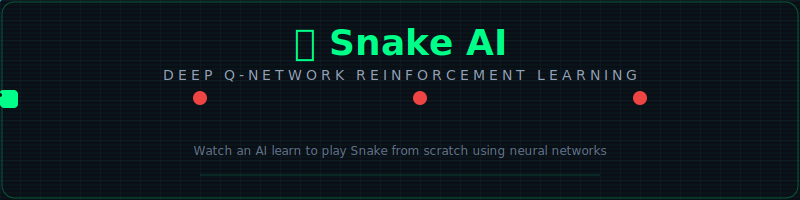

<p align="center">
  
</p>

<p align="center">
  
  
  
  
  
</p>

<p align="center">
  <b>An AI agent that learns to play Snake from scratch using Deep Q-Network (DQN) reinforcement learning.</b><br/>
  <sub>Watch a neural network go from random wandering to strategic apple hunting — in real time.</sub>
</p>

---

## 🧠 What Is This?

**Snake AI** is a complete reinforcement learning project where a neural network learns to play the classic Snake game entirely on its own — no human-coded rules, no hardcoded strategies. The AI starts by making completely random moves and, through thousands of trial-and-error episodes, gradually learns to:

- 🍎 **Hunt apples** efficiently
- 💀 **Avoid walls** and its own body
- 📏 **Grow longer** while navigating tight spaces
- 🧭 **Plan paths** instead of wandering aimlessly

The entire learning process is visualized in real-time through a premium **dark-themed Pygame dashboard** with live stats, score charts, and a neon-glow game display.

---

## 🎬 How It Works

The project implements the **Deep Q-Learning (DQN)** algorithm, a foundational technique in modern AI research (famously used by DeepMind to master Atari games).

### The Learning Loop

```
┌─────────────┐    ┌───────────┐    ┌───────────────┐    ┌────────────┐
│  Game State  │───▶│  DQN Agent │───▶│ Choose Action  │───▶│  Game Step  │
│  (11 features)│   │  (Neural Net)│   │ (ε-greedy)     │   │ (move snake)│
└─────────────┘    └───────────┘    └───────────────┘    └────────────┘
       ▲                                                         │
       │              ┌───────────────┐                          │
       └──────────────│ Train on reward│◀─────────────────────────┘
                      │ (+10 apple,    │
                      │  -10 death,    │
                      │  ±0.1 distance)│
                      └───────────────┘
```

### State Representation (11 Features)

The AI doesn't "see" the grid like a human. Instead, it perceives **11 binary signals**:

| # | Feature | Description |
|:-:|---------|-------------|
| 0 | `danger_straight` | Wall or body directly ahead? |
| 1 | `danger_right` | Wall or body to the right? |
| 2 | `danger_left` | Wall or body to the left? |
| 3 | `food_up` | Is the apple above? |
| 4 | `food_down` | Is the apple below? |
| 5 | `food_left` | Is the apple to the left? |
| 6 | `food_right` | Is the apple to the right? |
| 7 | `dir_up` | Currently heading up? |
| 8 | `dir_right` | Currently heading right? |
| 9 | `dir_down` | Currently heading down? |
| 10 | `dir_left` | Currently heading left? |

### Neural Network Architecture

```
Input (11) ──▶ Dense(256) + ReLU + Dropout ──▶ Dense(128) + ReLU + Dropout ──▶ Output (3)
                                                                                  │
                                                                    ┌─────────────┼─────────────┐
                                                                    ▼             ▼             ▼
                                                                 Straight      Turn Right    Turn Left
```

| Layer | Neurons | Activation | Purpose |
|-------|---------|------------|---------|
| Input | 11 | — | State encoding |
| Hidden 1 | 256 | ReLU | Feature extraction |
| Dropout | 10% | — | Regularization |
| Hidden 2 | 128 | ReLU | Decision refinement |
| Dropout | 10% | — | Regularization |
| Output | 3 | Linear | Q-values for actions |

### Reward System

| Event | Reward | Rationale |
|-------|--------|-----------|
| 🍎 Eat apple | **+10.0** | Primary objective |
| 💀 Hit wall / self | **-10.0** | Must learn to avoid death |
| ➡️ Move closer to apple | **+0.1** | Shapes efficient pathing |
| ⬅️ Move away from apple | **-0.1** | Discourages wandering |
| ⏱️ Exceeded max steps | **-10.0** | Prevents infinite loops |

---

## 📂 Project Structure

```
snake_io/
├── 🎮 main.py              # Entry point — training loop with live visualization
├── 🐍 game.py              # Snake game engine (pure logic, no rendering)
├── 🤖 agent.py             # DQN agent — epsilon-greedy, experience replay
├── 🧠 model.py             # PyTorch neural network + Bellman trainer
├── 🎨 renderer.py          # Premium Pygame dashboard with neon effects
├── ⚡ pretrain.py           # Headless pre-training script (250 games)
├── 🧪 test_training.py     # Quick training test (200 games, no GUI)
├── 🧪 test_growth.py       # Visual test — verifies snake grows on eating
├── 📋 requirements.txt     # Python dependencies
├── 📁 model/               # Saved model weights (auto-generated)
│   └── snake_dqn.pth       # Best DQN model checkpoint
└── 📁 assets/              # README assets
    └── snake_animation.svg  # Animated banner
```

---

## 🚀 Getting Started

### Prerequisites

- **Python 3.8+** installed
- **pip** package manager
- A display / monitor (for the visual training mode)

### Installation

```bash
# 1. Clone the repository
git clone https://github.com/your-username/snake_io.git
cd snake_io

# 2. (Optional) Create a virtual environment
python -m venv venv
source venv/bin/activate       # macOS / Linux
# venv\Scripts\activate        # Windows

# 3. Install dependencies
pip install -r requirements.txt
```

### Running the AI

#### 🎮 Full Visual Training (Recommended)
```bash
python main.py
```
You'll be prompted for a grid size (5–30, recommended **10**), then a Pygame window opens showing the AI learning in real-time.

#### ⚡ Headless Pre-training
```bash
python pretrain.py
```
Runs 250 training episodes without a display. Saves the trained model to `model/snake_dqn.pth`.

#### 🧪 Quick Training Test
```bash
python test_training.py
```
Trains for 200 games with console output — useful for verifying everything works.

#### 🧪 Visual Growth Test
```bash
python test_growth.py
```
Opens a Pygame window and verifies the snake correctly grows after eating an apple.

---

## 🎮 Controls

| Key | Action |
|:---:|--------|
| <kbd>↑</kbd> / <kbd>↓</kbd> | Increase / Decrease visualization speed |
| <kbd>Space</kbd> | Pause / Resume training |
| <kbd>M</kbd> | Toggle max-speed mode (no rendering) |
| <kbd>R</kbd> | Reset agent (clear learned weights) |
| <kbd>Q</kbd> / <kbd>Esc</kbd> | Quit and save model |

---

## 📊 Training Dashboard

The live dashboard displays everything you need to monitor the AI's learning progress:

| Panel | What It Shows |
|-------|---------------|
| **Game Grid** | The snake (neon green with gradient), apple (pulsing red glow), and grid |
| **Episode Counter** | How many games the AI has played |
| **Score / High Score** | Current and best scores across all episodes |
| **Snake Length** | Current snake length (starts at 3) |
| **Exploration (ε)** | Epsilon value — starts at 1.0 (random), decays to 0.01 |
| **Avg Score** | Rolling average over the last 100 games |
| **Loss** | MSE loss from the neural network training |
| **Score History** | Live chart plotting individual and average scores |
| **Neural Network** | Visual diagram of the 11→256→128→3 architecture |

---

## 📈 Expected Learning Progression

| Games | Epsilon (ε) | Behavior | Expected Avg Score |
|------:|:-----------:|----------|:------------------:|
| 0–20 | 1.0 → 0.87 | Completely random moves | 0–1 |
| 20–50 | 0.87 → 0.67 | Starts to avoid walls occasionally | 1–3 |
| 50–100 | 0.67 → 0.33 | Learns to seek nearby apples | 3–6 |
| 100–150 | 0.33 → 0.01 | Strategic hunting, avoids self | 5–10 |
| 150+ | 0.01 (fixed) | Exploitation mode — fully trained | 8–15+ |

> **💡 Tip:** The AI typically shows clear improvement after ~80–100 games. By game 200+, it should consistently score 8+ on a 10×10 grid.

---

## ✅ Pros & Cons

### ✅ Strengths

| Strength | Description |
|----------|-------------|
| 🎓 **Educational** | Clean, well-documented code makes it perfect for learning RL fundamentals |
| 👁️ **Visual Learning** | Watch the AI learn in real-time — not just numbers in a terminal |
| 🏗️ **Modular Design** | Game engine, agent, model, and renderer are fully decoupled |
| 💾 **Save & Resume** | Model auto-saves on new high scores; loads existing weights on startup |
| ⚙️ **Configurable** | Adjustable grid size (5–30), speed controls, max-speed training mode |
| 📊 **Rich Dashboard** | Premium Pygame UI with live charts, neon effects, and detailed metrics |
| 🧪 **Test Suite** | Includes test scripts for training verification and growth mechanics |
| 🔄 **Experience Replay** | Uses a 100K experience buffer for stable, sample-efficient learning |

### ⚠️ Limitations

| Limitation | Description |
|------------|-------------|
| 🐌 **Training Speed** | PyTorch CPU-only — no GPU acceleration out of the box |
| 📐 **Simple State** | 11-feature vector doesn't capture the full grid layout (e.g., body traps) |
| 🧠 **Single Network** | No target network — can cause Q-value overestimation instability |
| 🎯 **No Prioritized Replay** | Random sampling from buffer; important experiences aren't prioritized |
| 📏 **Scale Limits** | Performance degrades on grids larger than ~20×20 due to state representation |
| 🔁 **No Curriculum** | Starts on the full grid — no progressive difficulty increase |
| 🖥️ **Display Required** | Visual mode needs a monitor; headless mode has no progress visualization |

---

## 🔧 Key Hyperparameters

| Parameter | Value | File | Purpose |
|-----------|-------|------|---------|
| Learning Rate | `0.001` | `main.py` | Adam optimizer step size |
| Gamma (γ) | `0.9` | `main.py` | Discount factor for future rewards |
| Epsilon Decay | `1/150` per game | `agent.py` | Exploration decay rate |
| Min Epsilon | `0.01` | `agent.py` | Minimum exploration rate |
| Replay Buffer | `100,000` | `agent.py` | Maximum stored experiences |
| Batch Size | `256` | `agent.py` | Replay training batch size |
| Max Steps | `2 × grid²` | `game.py` | Timeout per episode |
| Dropout | `0.1` | `model.py` | Regularization rate |

---

## 🛣️ Future Improvements

- [ ] 🎯 **Target Network** — Add a separate target DQN for stable Q-value estimation
- [ ] 🏆 **Prioritized Experience Replay** — Sample important transitions more frequently  
- [ ] 🖼️ **CNN Vision** — Feed raw grid pixels to a convolutional network
- [ ] 🏋️ **Curriculum Learning** — Start on small grids, progressively increase size
- [ ] ⚡ **GPU Support** — Auto-detect CUDA/MPS for faster training
- [ ] 📊 **TensorBoard Integration** — Advanced training visualization and logging
- [ ] 🤖 **Dueling DQN** — Separate value and advantage streams for better policy
- [ ] 🎮 **Human vs AI Mode** — Play against the trained agent

---

## 🧩 Dependencies

| Package | Version | Purpose |
|---------|---------|---------|
| `pygame` | ≥ 2.5.0 | Game rendering and UI |
| `torch` | ≥ 2.0.0 | Neural network (DQN) |
| `numpy` | ≥ 1.24.0 | Array operations and state encoding |
| `matplotlib` | ≥ 3.7.0 | Plotting utilities |

---

## 📜 License

This project is open source and available under the [MIT License](LICENSE).

---

<p align="center">
  Made with 🐍 + 🧠 + ❤️
  <br/>
  <sub>If this project helped you learn reinforcement learning, give it a ⭐!</sub>
</p>
